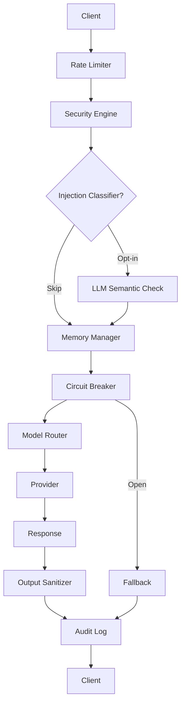

```
     ███████████                                                █████   
    ░░███░░░░░███                                              ░░███    
     ░███    ░███ ████████   ██████  █████████████   ████████  ███████  
     ░██████████ ░░███░░███ ███░░███░░███░░███░░███ ░░███░░███░░░███░   
     ░███░░░░░███ ░███ ░░░ ░███ ░███ ░███ ░███ ░███  ░███ ░███  ░███    
     ░███    ░███ ░███     ░███ ░███ ░███ ░███ ░███  ░███ ░███  ░███ ███
     ███████████  █████    ░░██████  █████░███ █████ ░███████   ░░█████ 
    ░░░░░░░░░░░  ░░░░░      ░░░░░░  ░░░░░ ░░░ ░░░░░  ░███░░░     ░░░░░  
                                                 ░███               
                                                 █████              
                                                ░░░░░               
```

---

<h1 align="center" id="top">
  <picture>
    <source media="(prefers-color-scheme: dark)" srcset="assets/dark.png">
    <source media="(prefers-color-scheme: light)" srcset="assets/light.png">
    
  </picture>
</h1>

<p align="center">
  
  
  
  
  
</p>

<p align="center">
  
  
  
  
  
  
  
</p>

---

<p align="center"><strong>Table of Contents</strong></p>
<p align="center">
  <a href="#1-system-architecture-overview">Architecture</a> ·
  <a href="#2-repository-layout">Layout</a> ·
  <a href="#3-configuration-manifest">Config</a> ·
  <a href="#4-quick-start">Quick Start</a> ·
  <a href="#5-providers">Providers</a> ·
  <a href="#6-api-reference">API</a> ·
  <a href="#7-cicd-pipeline">CI/CD</a> ·
  <a href="#8-production-readiness">Production</a> ·
  <a href="#9-license">License</a>
</p>

---

## 1. System Architecture Overview

The **Brompt Engine** addresses the fundamental limitations of modern LLM agents: non-deterministic execution paths and linear context drift (`O(N)` token growth). It acts as an execution middleware positioning itself between host application environments and upstream model endpoints.

**Performance Note:** The security pipeline is `O(N)` on input length, but with a 64KB cap the worst-case runtime is bounded. In practice the LLM provider call (1–10s) dominates end-to-end latency by 2–3 orders of magnitude, so input-size variance in the pipeline is negligible.

**Note on the pattern-matching security layer:** `SecurityEngine.sanitize`
is a regex blocklist. It catches unsophisticated, literal injection
attempts (including Arabic-language variants) but is not a robust defense
against paraphrased, encoded, or otherwise obfuscated prompt injection —
no blocklist is. Treat it as a cheap first filter, not a guarantee, and
pair it with the output sanitizer and least-privilege tool/permission
design on the application side.

### Request Flow



### Core Architecture Pillars:

| Pillar | Description |
|---|---|
| **Defense in Depth Security** | Multi-layered protection: input sanitization, output redaction, payload size limits, rate limiting, and hash-chained audit logging |
| **Bounded State Management** | Thread-safe `deque(maxlen=max_turns)` turn history — no raw message accumulation across turns |
| **Structured Type Contracts** | Pydantic v2 schema validation guarantees typed, programmatic outputs for downstream tooling |
| **Modern Type Safety** | Python 3.10+ `dict`, `list`, `str \| None` annotations for better IDE support and static analysis |
| **Pluggable Provider System** | 7 LLM providers: Anthropic, OpenAI, Ollama, Gemini, Mistral, Azure OpenAI, LM Studio — sync + async |
| **Template Engine** | Variable interpolation, filters (`upper`, `json`, `now`, etc.), conditionals, loops — 6 built-in prompt templates |
| **Hooks/Middleware** | Pipeline hooks (Logging, Timing, Validation, Audit, RateLimit, Security) with before/after execution |
| **Observability** | Distributed tracing, Prometheus-format metrics, alert rules with condition evaluation |
| **Circuit Breaker** | CLOSED/OPEN/HALF_OPEN state machine protecting providers from cascading failures; fallback support |
| **Model Router** | Heuristic complexity classifier (word count, code/math markers, analytical keywords) with 4 strategies: CHEAPEST, FASTEST, BEST_QUALITY, FALLBACK |
| **Semantic Classifier** | Opt-in LLM-based injection classifier — catches paraphrased attacks the regex layer misses |
| **Pricing & Optimization** | Cost estimation per model, token optimization with caching, savings tracking |
| **CLI (Typer)** | 8 commands: `chat`, `run`, `history`, `audit`, `status`, `templates`, `config`, `clear` |
| **Web UI** | Streamlit-based interface with chat panel, metrics dashboard, audit viewer, template browser |
| **Tkinter GUI** | Always-on-top floating widget with Docs, Live, Chart, Chat, Settings tabs |

---

## 2. Repository Layout

```text
Brompt/
├── .github/
│   └── workflows/
│       └── ci.yml                    # GitHub Actions CI/CD Pipeline
├── assets/
│   ├── dark.png                      # Dark mode banner
│   └── light.png                     # Light mode banner
├── src/
│   └── brompt/
│       ├── __init__.py               # Package root — exports all public API
│       ├── _cli_legacy.py            # Legacy TUI (preserved for compatibility)
│       ├── _providers_legacy.py      # Legacy provider system (sync)
│       ├── schema.py                 # Data Models & System Schemas
│       ├── security.py               # Ingress filtering + output redaction
│       ├── memory.py                 # Bounded turn history + session state (Thread-Safe)
│       ├── ratelimit.py              # Per-caller sliding-window rate limiter
│       ├── audit.py                  # Hash-chained, tamper-evident audit log
│       ├── config.py                 # Dataclass configs (WidgetConfig, ProviderConfig, etc.)
│       ├── session.py                # Session management (Session, SessionManager, Message)
│       ├── widget.py                 # Unified BromptWidget entry point
│       ├── hooks.py                  # Hooks/middleware system (Logging, Timing, Validation, etc.)
│       ├── observability.py          # Tracing, metrics (Prometheus), alert management
│       ├── circuit_breaker.py        # CLOSED/OPEN/HALF_OPEN state machine with fallback
│       ├── router.py                 # ModelRouter — heuristic complexity classification, 4 strategies
│       ├── classifier.py             # LLM-based semantic injection classifier (opt-in)
│       ├── pricing.py                # Cost estimation per provider/model
│       ├── optimizer.py              # Token optimization and compression
│       ├── core/
│       │   ├── __init__.py           # Re-exports BromptEngine
│       │   ├── engine.py             # Main Execution Runtime Engine
│       │   └── template_engine.py    # Template engine (variables, filters, control flow, 6 built-in templates)
│       ├── providers/
│       │   ├── __init__.py           # Provider registry with all 7 providers
│       │   ├── base.py               # Abstract LLMProvider base class
│       │   ├── factory.py            # ProviderFactory + ProviderRegistry
│       │   ├── openai_provider.py    # OpenAI / ChatGPT / GPT-4o
│       │   ├── anthropic_provider.py # Anthropic / Claude
│       │   ├── google_provider.py    # Google Gemini
│       │   ├── mistral_provider.py   # Mistral AI
│       │   ├── ollama_provider.py    # Ollama (local)
│       │   └── azure_provider.py     # Azure OpenAI
│       ├── cli/
│       │   ├── __init__.py           # CLI package
│       │   └── main.py               # Typer-based CLI (8 commands)
│       ├── guiapp/                   # Tkinter GUI application
│       │   ├── __init__.py           # BromptWidget — floating always-on-top panel
│       │   ├── ui.py                 # Tab bar, title bar, resize grip, tooltip, keyboard bindings
│       │   ├── chart.py              # ChartEngine — 5 chart types (bar, line, area, stacked, donut)
│       │   ├── theme.py              # Design tokens (colors, fonts, spacing)
│       │   └── badge.py              # System tray / Toplevel badge for minimize
│       ├── api/                      # FastAPI REST API server
│       └── feedback/                 # Feedback loop system
├── webui/
│   └── streamlit_app.py             # Streamlit web UI
├── tests/
│   ├── test_core.py                 # Core Runtime Unit Tests
│   ├── test_security.py             # Security Filter Unit Tests
│   ├── test_memory.py               # Memory Engine Unit Tests
│   ├── test_providers.py            # Provider Abstraction Unit Tests
│   ├── test_ratelimit.py            # Rate Limiter Unit Tests
│   ├── test_audit.py                # Audit Log Unit Tests
│   ├── test_api.py                  # API endpoint tests
│   └── ...                          # Feedback, retry, classifier, etc.
├── agent.brompt.yaml                # Declarative Runtime Manifest
├── pyproject.toml                   # Package Configuration & Dependencies
└── README.md                        # Technical Specification
```

---

## 3. Configuration Manifest

Runtime behavior is governed by `agent.brompt.yaml`:

```yaml
metadata:
  name: "ProductionAgentEngine"
  version: "0.1.0-alpha"
  environment: "production"

security_policy:
  isolation_level: "ZERO_TRUST"
  sanitize_inputs: true
  max_payload_size_kb: 64

memory_strategy:
  paging_mode: "VIRTUAL_STATE_O1"
  max_history_turns: 3

rate_limit:
  max_requests: 30
  window_seconds: 60

schema_validation:
  strict_mode: true
```

---

## 4. Quick Start

```bash
# Clone
git clone https://github.com/sh0-dax/Brompt.git
cd Brompt

# Install
python -m venv venv
source venv/bin/activate

# Install with a specific provider (pick one)
pip install -e ".[anthropic]"     # Anthropic / Claude
pip install -e ".[openai]"        # OpenAI / ChatGPT / GPT-4o
pip install -e ".[ollama]"        # Ollama (local)
pip install -e ".[gemini]"        # Google Gemini
pip install -e ".[mistral]"       # Mistral
pip install -e ".[azure]"         # Azure OpenAI
pip install -e ".[lmstudio]"      # LM Studio (local)
pip install -e ".[all]"           # All providers + web UI

# Run tests
pytest -v

# Launch CLI (interactive chat)
brompt chat

# Run a single prompt
brompt run "What is the capital of France?"

# List available templates
brompt templates

# Launch web UI (requires pip install -e ".[webui]")
streamlit run webui/streamlit_app.py
```

---

## 5. Providers

Brompt supports **7 LLM providers** via a pluggable provider system. Each is an optional dependency — install only what you need.

### Provider Matrix

| Provider | Package | Env Variable(s) | Default Model | Type |
|---|---|---|---|---|
| **Anthropic** | `anthropic` | `ANTHROPIC_API_KEY` | `claude-sonnet-4-5` | Cloud |
| **OpenAI** | `openai` | `OPENAI_API_KEY` | `gpt-4o` | Cloud |
| **Ollama** | `ollama` | `OLLAMA_HOST` | `llama3.2` | Local |
| **Gemini** | `google-genai` | `GEMINI_API_KEY` | `gemini-2.5-flash` | Cloud |
| **Mistral** | `mistralai` | `MISTRAL_API_KEY` | `mistral-large-latest` | Cloud |
| **Azure OpenAI** | `openai` | `AZURE_OPENAI_API_KEY`, `AZURE_OPENAI_ENDPOINT`, `AZURE_OPENAI_DEPLOYMENT` | — | Cloud |
| **LM Studio** | `openai` | `LM_STUDIO_HOST` | `default` | Local |

### Environment Variables

```bash
# Cloud providers
export ANTHROPIC_API_KEY=sk-ant-...
export OPENAI_API_KEY=sk-...
export GEMINI_API_KEY=...
export MISTRAL_API_KEY=...
export AZURE_OPENAI_API_KEY=...
export AZURE_OPENAI_ENDPOINT=https://myinstance.openai.azure.com
export AZURE_OPENAI_DEPLOYMENT=gpt-4o-deployment

# Local providers
export OLLAMA_HOST=http://localhost:11434         # default
export LM_STUDIO_HOST=http://localhost:1234/v1     # default
```

### Auto-Detection

When no provider is explicitly injected, `build_provider_from_env()` checks environment variables in this priority order:

1. `ANTHROPIC_API_KEY` → Anthropic
2. `OPENAI_API_KEY` → OpenAI
3. `GEMINI_API_KEY` → Gemini
4. `MISTRAL_API_KEY` → Mistral
5. `AZURE_OPENAI_API_KEY` → Azure OpenAI
6. `OLLAMA_HOST` → Ollama
7. `LM_STUDIO_HOST` → LM Studio

If none are set, the engine runs in **dry-run / validation-only mode** — input is sanitized, state is managed, but no LLM is called.

---

## 6. API Reference

### `BromptEngine(config_path, provider=None, async_provider=None, rate_limiter=None, injection_classifier=None, circuit_breaker=None)`

Core runtime entry point. Loads YAML manifest and initializes all subsystems.

| Parameter | Type | Default | Description |
|---|---|---|---|
| `config_path` | `str` | `"agent.brompt.yaml"` | Path to runtime manifest |
| `provider` | `LLMProvider \| None` | `None` | Sync provider (auto-detected from env if `None`) |
| `async_provider` | `LLMProvider \| None` | `None` | Async provider for `execute_async()` |
| `audit_log_path` | `str \| None` | `None` | Custom audit log path |

**Methods:**

- `execute(user_query, context=None, caller_id="default", system_prompt=None) → ExecutionResult` — Synchronous pipeline.
- `execute_async(user_query, context=None, caller_id="default", system_prompt=None) → ExecutionResult` — Same pipeline, awaitable.

### `LLMProvider` (ABC)

Base class for all providers. Implement `generate()` for sync, optionally `agenerate()` for async.

| Method | Returns | Description |
|---|---|---|
| `generate(messages, system=None)` | `str` | Call the LLM with bounded turn history |
| `agenerate(messages, system=None)` | `str` | Async counterpart (optional) |

### `SecurityEngine.sanitize(text)`

Validates input against adversarial patterns. Raises `SecurityViolationError` or `ValueError` on violation.

### `SecurityEngine.sanitize_output(text)`

Redacts secret-like content (API keys, tokens) from model output.

### `MemoryManager(max_turns)`

Thread-safe bounded state manager.

| Method | Returns | Description |
|---|---|---|
| `update_state(key, value)` | `None` | Thread-safe state update |
| `get_state()` | `dict[str, Any]` | Snapshot copy of the current state |
| `add_turn(role, content)` | `None` | Append a conversation turn |
| `get_history()` | `list[dict[str, str]]` | Bounded turn history |
| `clear()` | `None` | Thread-safe state + history flush |

### `RateLimiter(max_requests, window_seconds)`

Per-caller sliding-window rate limiter.

| Method | Raises | Description |
|---|---|---|
| `check(identifier)` | `RateLimitExceededError` | Register a hit; raises if budget exhausted |

### `AuditLog(path)`

SHA-256 hash-chained, append-only audit log.

| Method | Returns | Description |
|---|---|---|
| `record(event, state_id, is_secure, detail=None)` | `dict` | Append a tamper-evident record |
| `verify()` | `bool` | Replay chain; `False` if tampered |
| `read_all()` | `list[dict]` | Read all entries |

### `CircuitBreaker(failure_threshold=5, recovery_timeout=30.0, half_open_max_calls=3)`

Protects providers from cascading failures with a CLOSED/OPEN/HALF_OPEN state machine.

| Parameter | Type | Default | Description |
|---|---|---|---|
| `failure_threshold` | `int` | `5` | Consecutive failures before opening the circuit |
| `recovery_timeout` | `float` | `30.0` | Seconds before transitioning to HALF_OPEN |
| `half_open_max_calls` | `int` | `3` | Probe requests allowed in HALF_OPEN state |

| Method | Returns | Description |
|---|---|---|
| `call(coro, fallback=None)` | `Any` | Async call; raises `CircuitBreakerOpenError` if open |
| `call_sync(fn, args=(), kwargs={}, fallback=None)` | `Any` | Sync counterpart |

### `ModelRouter(profiles=None, strategy=RoutingStrategy.CHEAPEST)`

Routes prompts to the optimal provider based on complexity classification.

| Method | Returns | Description |
|---|---|---|
| `classify_complexity(text)` | `ComplexityLevel` | Heuristic: word count, code/math markers, analytical keywords |
| `score_providers(text)` | `list[Route]` | Ranked list of (provider, model, score, estimated_cost) |
| `route(text, strategy=None)` | `Route` | Select provider by strategy (CHEAPEST / FASTEST / BEST_QUALITY / FALLBACK) |

### `InjectionClassifier(provider, model=None)`

Opt-in LLM-based semantic injection detector — catches paraphrased attacks.

| Method | Returns | Description |
|---|---|---|
| `is_blocked(text)` | `ClassificationResult \| None` | `None` if unavailable; raises `InjectionClassificationError` on failure |

---

### CLI Commands

```text
Usage: brompt [OPTIONS] COMMAND [ARGS]...

Commands:
  chat       Start an interactive chat session
  run        Execute a single prompt
  history    Show conversation history
  audit      Show audit log entries
  status     Show engine status and configuration
  templates  List or render prompt templates
  config     Show or validate a Brompt config file
  clear      Clear engine memory and history
```

### `BromptWidget(config=None)`

Unified high-level entry point combining engine, session, and widget config.

```python
from brompt import BromptWidget

widget = BromptWidget()
result = widget.execute("Hello!")
print(result.data)
```

### Template Engine

```python
from brompt import Template, template_registry

# Simple template with filters
t = Template("Hello {{ name|upper }}!", name="greeting")
print(t.render(name="world"))  # "Hello WORLD!"

# Built-in templates
rendered = template_registry.render("chat",
    user_message="What's new?",
    system_prompt="You are a helpful assistant.",
    messages=[],
)

# Register custom template
from brompt.core.template_engine import create_builtin_templates
reg = create_builtin_templates()
reg.render("code_review", language="python", code="print('hello')")
```

**Built-in templates:** `chat`, `code_review`, `summarize`, `translate`, `analysis`, `debug`

**Filters:** `upper`, `lower`, `capitalize`, `title`, `trim`, `json`, `now`

### Hooks / Middleware

```python
from brompt import HooksManager, LoggingHook, TimingHook, ValidationHook

hooks = HooksManager()
hooks.register(LoggingHook())
hooks.register(TimingHook())

query, ctx = hooks.before_execute("Hello", None)
result = engine.execute(query, ctx)
result = hooks.after_execute(result)
```

**Built-in hooks:** `LoggingHook`, `TimingHook`, `ValidationHook`, `AuditHook`, `RateLimitHook`, `SecurityHook`

### Observability

```python
from brompt import tracer, metrics, AlertManager, AlertRule

# Tracing
span = tracer.start_span("llm_call", attributes={"model": "gpt-4"})
span.finish()

# Metrics
metrics.inc("api_calls")
metrics.observe("latency_ms", 320.5)
print(metrics.export_prometheus())

# Alerts
am = AlertManager()
am.add_rule(AlertRule(
    name="high_error_rate",
    condition=lambda ctx: ctx.get("errors", 0) > 10,
    message="Error rate exceeds threshold",
))
am.evaluate({"errors": 15})
```

### Web UI

```bash
pip install -e ".[webui]"
streamlit run webui/streamlit_app.py
```

Opens a browser-based interface with chat panel, metrics dashboard, audit log viewer, and template browser.

### Tkinter GUI

```bash
python -m brompt.guiapp [--live]
```

Always-on-top floating widget with 5 tabs (Docs, Live Status, Charts, Chat, Settings), system tray minimize, and live engine monitoring.

---

## 7. CI/CD Pipeline

GitHub Actions runs tests on every push/PR across Python 3.10–3.13:

```yaml
matrix:
  python-version: ["3.10", "3.11", "3.12", "3.13"]
```

---

## 8. Production Readiness

**Current Status: Production-Ready (v2)** — Brompt is now a stable, feature-complete LLM gateway. The following capabilities are shipped:

- ✅ Security guardrails with input sanitization (regex blocklist — treat as a first filter, not a guarantee)
- ✅ Bounded turn history (`deque(maxlen=max_turns)`)
- ✅ Schema validation
- ✅ Rate limiting (in-process sliding window; not distributed — multi-instance needs Redis)
- ✅ Security audit logging (SHA-256 hash-chained, append-only, tamper-evident via `AuditLog.verify()`)
- ✅ Output sanitization layer (redacts secret-like strings before they reach the caller)
- ✅ 7 LLM providers (Anthropic, OpenAI, Ollama, Gemini, Mistral, Azure OpenAI, LM Studio)
- ✅ Async execution path (`execute_async` with thread offloading for sync providers)
- ✅ Template engine with filters, conditionals, loops
- ✅ Hooks/middleware pipeline (before/after execution)
- ✅ Observability (tracing, Prometheus metrics, alert rules)
- ✅ Typer CLI (8 commands) + Streamlit web UI + Tkinter GUI
- ✅ Circuit Breaker (CLOSED/OPEN/HALF_OPEN state machine with fallback)
- ✅ Model Router (heuristic complexity classification, 4 routing strategies)
- ✅ Redis caching (key-value with in-process LRU/SmartCache fallback)
- ✅ LLM-based semantic injection classifier (opt-in, catches paraphrased attacks)
- ⚠️ **Pending:** Distributed rate limiting for multi-instance deployments

---

## 9. License

MIT License — see [LICENSE](LICENSE) for details.

---

<p align="center">
  <a href="#top">⬆ Back to Top</a>
</p>

<p align="center">
  <sub>Built by ❤️ <b>SH ÂZZOUZ</b> — <a href="https://github.com/sh0-dax" target="_blank">sh0-dax</a></sub>
</p>
