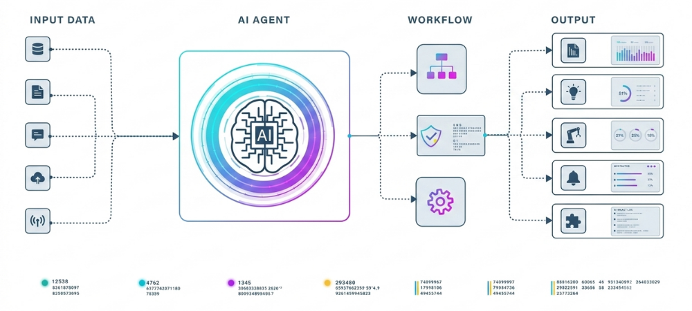
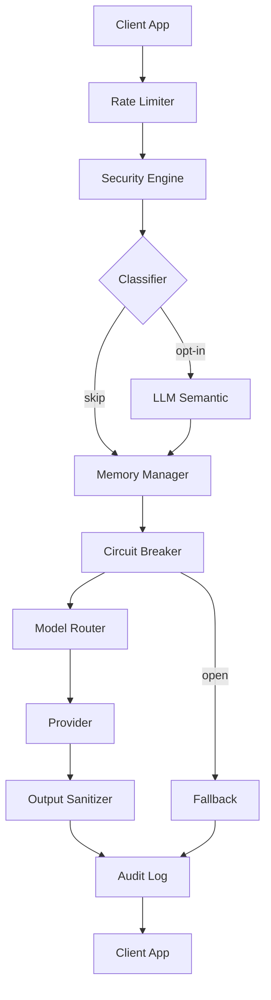

```
     ███████████                                                █████   
    ░░███░░░░░███                                              ░░███    
     ░███    ░███ ████████   ██████  █████████████   ████████  ███████  
     ░██████████ ░░███░░███ ███░░███░░███░░███░░███ ░░███░░███░░░███░   
     ░███░░░░░███ ░███ ░░░ ░███ ░███ ░███ ░███ ░███  ░███ ░███  ░███    
     ░███    ░███ ░███     ░███ ░███ ░███ ░███ ░███  ░███ ░███  ░███ ███
     ███████████  █████    ░░██████  █████░███ █████ ░███████   ░░█████ 
    ░░░░░░░░░░░  ░░░░░      ░░░░░░  ░░░░░ ░░░ ░░░░░  ░███░░░     ░░░░░  
                                                 ░███               
                                                 █████              
                                                ░░░░░               
```

---

<h1 align="center" id="top">
  <picture>
    <source media="(prefers-color-scheme: dark)" srcset="assets/dark.png">
    <source media="(prefers-color-scheme: light)" srcset="assets/light.png">
    
  </picture>
</h1>

<p align="center">
  
  
  
  
  
  
</p>

<p align="center">
  
  
  
  
  
  
  
</p>

---

<p align="center"><strong>Table of Contents</strong></p>
<p align="center">
  <a href="#why-brompt">Why Brompt?</a> ·
  <a href="#1-system-architecture-overview">Architecture</a> ·
  <a href="#2-security-architecture">Security</a> ·
  <a href="#3-core-features">Features</a> ·
  <a href="#4-repository-layout">Layout</a> ·
  <a href="#5-configuration-manifest">Config</a> ·
  <a href="#6-quick-start">Quick Start</a> ·
  <a href="#7-providers">Providers</a> ·
  <a href="#8-api-reference">API</a> ·
  <a href="#9-advanced-features">Advanced</a> ·
  <a href="#10-cicd-pipeline">CI/CD</a> ·
  <a href="#11-production-readiness">Production</a> ·
  <a href="#12-license">License</a>
</p>

---

## Why Brompt?

**Brompt is compliance-grade LLM middleware — not another provider abstraction layer.**

LangChain and LiteLLM compete on breadth (100+ providers, large communities). Brompt doesn't. Brompt competes on trust: **signed execution receipts, hash-chained audit trails, and policy-as-code governance for regulated industries** (legal, financial, government).

They route. Brompt proves.

| Why NOT LangChain / LiteLLM | Brompt's answer |
|---|---|
| No non-repudiation — responses can't be verified after the fact | **Signed execution receipts** (audit `entry_hash` embedded in each `ExecutionResult`) — every response is provably linked to a tamper-evident audit entry |
| Audit is an afterthought (text logs) | **Hash-chained audit log** — `AuditLog.verify()` replays the chain and detects any tampering |
| No deterministic replay — changing models changes behavior silently | `PromptClient.replay(id, model=X)` — re-runs the same prompt on a different model and diffs the result to detect **prompt drift** |
| Security filters are either absent or opaque | **Defense-in-depth**: regex blocklist + LLM semantic classifier + output redaction, all recorded in the audit chain |
| Policy is hardcoded or non-existent | **Policy-as-code**: per-tenant YAML policies (allow/deny per `caller_id`) evaluated before the prompt reaches any provider |
| No human-in-the-loop for gray zones | **Configurable confidence thresholds** — below 0.4 = pass, 0.4-0.7 = hold for human review, above 0.7 = block |
| Vendor lock-in — switching models means rewriting prompts | **Provider-agnostic pipeline** — drop-in swap between 7 providers; signed receipts prove what was submitted regardless of model |

### How Brompt works

Brompt sits **above** the provider layer. You can even use LiteLLM as a provider underneath Brompt — the compliance layer stays the same.

```text
Client App
    │
    ▼
┌─────────────────────────────────────────┐
│          BROMPT COMPLIANCE LAYER         │
│  ├ Rate Limiter     ├ Security Engine    │
│  ├ Policy-as-Code   ├ Classifier (LLM)   │
│  ├ Circuit Breaker  ├ Model Router       │
│  ├ Token Optimizer  ├ Memory Manager     │
│  └ Audit Log (hash-chained, signed)      │
└─────────────────────────────────────────┘
    │
    ▼
┌─────────────────────────────────────────┐
│     PROVIDER (Anthropic / OpenAI / …)    │
└─────────────────────────────────────────┘
    │
    ▼
┌─────────────────────────────────────────┐
│    Execution Receipt (signed + logged)   │
└─────────────────────────────────────────┘
```

---

## 1. System Architecture Overview

The **Brompt Engine** addresses the fundamental limitations of modern LLM agents: non-deterministic execution paths and linear context drift (`O(N)` token growth). It acts as a compliance middleware positioning itself between host application environments and upstream model endpoints.

**Performance Note:** The security pipeline is `O(N)` on input length, but with a 64KB cap the worst-case runtime is bounded. In practice the LLM provider call (1–10s) dominates end-to-end latency by 2–3 orders of magnitude, so input-size variance in the pipeline is negligible.

**Note on the pattern-matching security layer:** `SecurityEngine.sanitize`
is a regex blocklist. It catches unsophisticated, literal injection
attempts (including Arabic-language variants) but is not a robust defense
against paraphrased, encoded, or otherwise obfuscated prompt injection —
no blocklist is. Treat it as a cheap first filter, not a guarantee, and
pair it with the output sanitizer and least-privilege tool/permission
design on the application side.

### Request Flow



### Core Architecture Pillars

| Pillar | Description |
| --- | --- |
| **Signed Execution Receipts** | Every `ExecutionResult` carries the audit entry's HMAC-signed `entry_hash` as a `receipt_hash` — non-repudiable proof that a response passed through the full compliance pipeline |
| **Hash-Chained Audit Log** | SHA-256 append-only chain with `AuditLog.verify()` — detects any tampering retroactively. Every security event is recorded with an immutable link |
| **Deterministic Replay** | `PromptClient.replay(id, model=X)` re-runs the same messages on a different model and diffs the output — catches **prompt drift** when upgrading models |
| **Policy-as-Code** | Per-tenant YAML policies (allow/deny per `caller_id`) evaluated before the prompt reaches any provider. No code changes needed per customer |
| **Human-in-the-Loop** | Configurable confidence thresholds (pass / hold-for-review / block) for gray-zone inputs — guarantees human oversight in sensitive deployments |
| **Defense in Depth Security** | Multi-layered: input canonicalization (NFKC, zero-width, base64, leetspeak), regex blocklist, LLM semantic classifier, output redaction |
| **Bounded State Management** | Thread-safe `deque(maxlen=max_turns)` turn history — no raw message accumulation across turns |
| **Structured Type Contracts** | Pydantic v2 schema validation guarantees typed, programmatic outputs for downstream tooling |
| **Pluggable Provider System** | 7 LLM providers: Anthropic, OpenAI, Ollama, Gemini, Mistral, Azure OpenAI, LM Studio — sync + async |
| **Hooks/Middleware** | Pipeline hooks (Logging, Timing, Validation, Audit, RateLimit, Security) with before/after execution |
| **Circuit Breaker** | CLOSED/OPEN/HALF_OPEN state machine protecting providers from cascading failures; fallback support |
| **Model Router** | Heuristic complexity classifier (word count, code/math markers, analytical keywords) with 4 strategies: CHEAPEST, FASTEST, BEST_QUALITY, FALLBACK |
| **Pricing & Optimization** | Per-model cost estimation, token optimization with compression, savings tracking |
| **CLI (Typer)** | 8 commands: `chat`, `run`, `history`, `audit`, `status`, `templates`, `config`, `clear` |
| **Web UI** | Streamlit-based interface with chat panel, metrics dashboard, audit viewer, template browser |
| **Tkinter GUI** | Always-on-top floating widget with Docs, Live, Chart, Chat, Settings tabs |

---

## 2. Security Architecture

Brompt implements a multi-layer defense-in-depth security pipeline, not a single regex blocklist.

### Layer 1: Input Canonicalization

- **NFKC Unicode normalization** — neutralizes homoglyph attacks
- **Zero-width character stripping** — removes invisible obfuscation (`\u200b`, `\u200c`, `\ufeff`, etc.)
- **Base64 payload detection** — heuristic scoring + validation of encoded payloads
- **Leetspeak normalization** — neutralizes `0→o`, `3→e`, `4→a`, `@→a`, `$→s`, etc.

### Layer 2: Pattern Blocklist

14 regex patterns covering 4 languages (English, Arabic, Italian, German) for:
- Direct instruction overrides
- System prompt leakage attempts
- Guardrail bypass attempts
- Jailbreak persona switches
- Role-play bypasses

### Layer 3: Semantic Classifier (`classifier.py`)

An optional LLM-based second line of defense that reasons about intent, not surface text:
- Catches paraphrased, translated, or obfuscated attacks
- Returns structured JSON: `{is_injection, confidence, reasoning}`
- Configurable confidence threshold (default 0.7)
- Off by default — costs an extra model call per request

### Layer 4: Output Sanitization

Redacts secret-like content before it reaches the caller:
- Anthropic API keys (`sk-ant-...`)
- OpenAI-style keys (`sk-...`)
- AWS access keys (`AKIA...`)
- Private key blocks
- GitHub / Slack tokens

### Layer 5: Audit-Grade Observability

- SHA-256 hash-chained, append-only audit log
- Tamper-evident via `AuditLog.verify()`
- Every security event recorded with immutable chain

**Note:** No blocklist is a guarantee. The classifier layer significantly raises the bar, but defense-in-depth design (least-privilege tools, output redaction, audit trails) is essential.

---

## 3. Core Features

### Circuit Breaker (`brompt.circuit_breaker`)

Standard CLOSED / OPEN / HALF_OPEN state machine:
- Configurable failure threshold + recovery timeout
- Thread-safe with `threading.Lock()`
- Supports sync (`call_sync`) and async (`call`) paths
- Built-in fallback support

```python
from brompt.circuit_breaker import CircuitBreaker

cb = CircuitBreaker(failure_threshold=5, recovery_timeout=30.0)
result = await cb.call(provider.generate(messages), fallback="Service unavailable")
```

### Model Router (`brompt.router`)

Route requests based on strategy:
- **Cheapest** — minimize cost
- **Fastest** — minimize latency
- **Best Quality** — maximize output quality
- **Fallback** — cascade on failure
- Complexity-aware — route simple queries to cheaper models

```python
from brompt.router import ModelRouter, RoutingStrategy

router = ModelRouter()
router.register_provider("cheap", ollama_provider)
router.register_provider("fast", openai_provider)
router.register_provider("quality", anthropic_provider)

route = await router.route(query, strategy=RoutingStrategy.CHEAPEST)
```

### Prompt Optimizer (`brompt.optimizer`)

Built-in prompt optimization utilities for token efficiency and output quality.

```python
from brompt.optimizer import TokenOptimizer

optimizer = TokenOptimizer()
compressed = optimizer.compress_context(messages)
```

### Cost Tracking (`brompt.pricing`)

Per-request cost estimation and tracking across providers.

```python
from brompt.pricing import estimate_cost

cost = estimate_cost("anthropic", prompt_tokens=150, completion_tokens=50)
# → 0.0012 (USD)
```

---

## 4. Repository Layout

```text
Brompt/
├── .github/
│   └── workflows/
│       └── ci.yml                    # GitHub Actions CI/CD Pipeline
├── assets/
│   ├── dark.png                      # Dark mode banner
│   └── light.png                     # Light mode banner
├── src/
│   └── brompt/
│       ├── __init__.py               # Package root — exports all public API
│       ├── providers_core.py         # Core provider integrations (sync)
│       ├── schema.py                 # Data Models & System Schemas
│       ├── security.py               # Ingress filtering + output redaction
│       ├── memory.py                 # Bounded turn history + session state (Thread-Safe)
│       ├── ratelimit.py              # Per-caller sliding-window rate limiter
│       ├── audit.py                  # Hash-chained, tamper-evident audit log
│       ├── config.py                 # Dataclass configs (WidgetConfig, ProviderConfig, etc.)
│       ├── session.py                # Session management (Session, SessionManager, Message)
│       ├── widget.py                 # PromptClient — unified client entry point
│       ├── hooks.py                  # Hooks/middleware system (Logging, Timing, Validation, etc.)
│       ├── observability.py          # Tracing, metrics (Prometheus), alert management
│       ├── circuit_breaker.py        # CLOSED/OPEN/HALF_OPEN state machine with fallback
│       ├── router.py                 # ModelRouter — heuristic complexity classification, 4 strategies
│       ├── classifier.py             # LLM-based semantic injection classifier (opt-in)
│       ├── policy.py                 # Policy-as-Code engine (per-tenant YAML allow/deny rules)
│       ├── pricing.py                # Cost estimation per provider/model
│       ├── optimizer.py              # Token optimization and compression
│       ├── core/
│       │   ├── __init__.py           # Re-exports BromptEngine
│       │   ├── engine.py             # Main Execution Runtime Engine
│       │   └── template_engine.py    # Template engine (variables, filters, control flow, 6 built-in templates)
│       ├── providers/
│       │   ├── __init__.py           # Provider registry with all 7 providers
│       │   ├── base.py               # Abstract LLMProvider base class
│       │   ├── factory.py            # ProviderFactory + ProviderRegistry
│       │   ├── openai_provider.py    # OpenAI / ChatGPT / GPT-4o
│       │   ├── anthropic_provider.py # Anthropic / Claude
│       │   ├── google_provider.py    # Google Gemini
│       │   ├── mistral_provider.py   # Mistral AI
│       │   ├── ollama_provider.py    # Ollama (local)
│       │   └── azure_provider.py     # Azure OpenAI
│       ├── cli/
│       │   ├── __init__.py           # CLI package
│       │   └── main.py               # Typer-based CLI (8 commands)
│       ├── guiapp/                   # Tkinter GUI application
│       │   ├── __init__.py           # BromptWidget — floating always-on-top panel (GUI, not backend)
│       │   ├── ui.py                 # Tab bar, title bar, resize grip, tooltip, keyboard bindings
│       │   ├── chart.py              # ChartEngine — 5 chart types (bar, line, area, stacked, donut)
│       │   ├── theme.py              # Design tokens (colors, fonts, spacing)
│       │   └── badge.py              # System tray / Toplevel badge for minimize
│       ├── api/                      # FastAPI REST API server
│       └── feedback/                 # Feedback loop system
├── webui/
│   └── streamlit_app.py             # Streamlit web UI
├── tests/
│   ├── test_core.py                 # Core Runtime Unit Tests
│   ├── test_security.py             # Security Filter Unit Tests
│   ├── test_memory.py               # Memory Engine Unit Tests
│   ├── test_providers.py            # Provider Abstraction Unit Tests
│   ├── test_ratelimit.py            # Rate Limiter Unit Tests
│   ├── test_audit.py                # Audit Log Unit Tests
│   ├── test_policy.py               # Policy Engine Unit Tests
│   ├── test_api.py                  # API endpoint tests
│   └── ...                          # Feedback, retry, classifier, etc.
├── agent.brompt.yaml                # Declarative Runtime Manifest
├── pyproject.toml                   # Package Configuration & Dependencies
└── README.md                        # Technical Specification
```

---

## 5. Configuration Manifest

Runtime behavior is governed by `agent.brompt.yaml`:

```yaml
metadata:
  name: "ProductionAgentEngine"
  version: "2.0.0"
  environment: "production"

security_policy:
  isolation_level: "ZERO_TRUST"
  sanitize_inputs: true
  max_payload_size_kb: 64

memory_strategy:
  paging_mode: "VIRTUAL_STATE_O1"
  max_history_turns: 3

rate_limit:
  max_requests: 30
  window_seconds: 60

# Policy rules (optional — see Policy-as-Code)
# security_policy:
#   rules:
#     - caller_id: "tenant-alpha-*"
#       action: allow
#     - caller_id: "suspected-bot-*"
#       action: deny
#       reason: "known abuse pattern"
```

---

## 6. Quick Start

```bash
# Clone
git clone https://github.com/sh0-dax/Brompt.git
cd Brompt

# Install
python -m venv venv
source venv/bin/activate

# Install with a specific provider (pick one)
pip install -e ".[anthropic]"     # Anthropic / Claude
pip install -e ".[openai]"        # OpenAI / ChatGPT / GPT-4o
pip install -e ".[ollama]"        # Ollama (local)
pip install -e ".[gemini]"        # Google Gemini
pip install -e ".[mistral]"       # Mistral
pip install -e ".[azure]"         # Azure OpenAI
pip install -e ".[lmstudio]"      # LM Studio (local)
pip install -e ".[all]"           # All providers + web UI

# Run tests
pytest -v

# Launch CLI (interactive chat)
brompt chat

# Run a single prompt
brompt run "What is the capital of France?"

# List available templates
brompt templates

# Launch web UI (requires pip install -e ".[webui]")
streamlit run webui/streamlit_app.py
```

---

## 7. Providers

Brompt supports **7 LLM providers** via a pluggable provider system. Each is an optional dependency — install only what you need.

### Provider Matrix

| Provider | Package | Env Variable(s) | Default Model | Type |
|---|---|---|---|---|
| **Anthropic** | `anthropic` | `ANTHROPIC_API_KEY` | `claude-sonnet-4-5` | Cloud |
| **OpenAI** | `openai` | `OPENAI_API_KEY` | `gpt-4o` | Cloud |
| **Ollama** | `ollama` | `OLLAMA_HOST` | `llama3.2` | Local |
| **Gemini** | `google-genai` | `GEMINI_API_KEY` | `gemini-2.5-flash` | Cloud |
| **Mistral** | `mistralai` | `MISTRAL_API_KEY` | `mistral-large-latest` | Cloud |
| **Azure OpenAI** | `openai` | `AZURE_OPENAI_API_KEY`, `AZURE_OPENAI_ENDPOINT`, `AZURE_OPENAI_DEPLOYMENT` | — | Cloud |
| **LM Studio** | `openai` | `LM_STUDIO_HOST` | `default` | Local |

### Environment Variables

```bash
# Cloud providers
export ANTHROPIC_API_KEY=sk-ant-...
export OPENAI_API_KEY=sk-...
export GEMINI_API_KEY=...
export MISTRAL_API_KEY=...
export AZURE_OPENAI_API_KEY=...
export AZURE_OPENAI_ENDPOINT=https://myinstance.openai.azure.com
export AZURE_OPENAI_DEPLOYMENT=gpt-4o-deployment

# Local providers
export OLLAMA_HOST=http://localhost:11434         # default
export LM_STUDIO_HOST=http://localhost:1234/v1     # default
```

### Auto-Detection

When no provider is explicitly injected, `build_provider_from_env()` checks environment variables in this priority order:

1. `ANTHROPIC_API_KEY` → Anthropic
2. `OPENAI_API_KEY` → OpenAI
3. `GEMINI_API_KEY` → Gemini
4. `MISTRAL_API_KEY` → Mistral
5. `AZURE_OPENAI_API_KEY` → Azure OpenAI
6. `OLLAMA_HOST` → Ollama
7. `LM_STUDIO_HOST` → LM Studio

If none are set, the engine runs in **dry-run / validation-only mode** — input is sanitized, state is managed, but no LLM is called.

---

## 8. API Reference

### `BromptEngine(config_path, provider=None, async_provider=None, audit_log_path=None, audit_secret_key=None, rate_limiter=None, injection_classifier=None, circuit_breaker=None)`

Core runtime entry point. Loads YAML manifest and initializes all subsystems.

| Parameter | Type | Default | Description |
|---|---|---|---|
| `config_path` | `str` | `"agent.brompt.yaml"` | Path to runtime manifest |
| `provider` | `LLMProvider \| None` | `None` | Sync provider (auto-detected from env if `None`) |
| `async_provider` | `LLMProvider \| None` | `None` | Async provider for `execute_async()` |
| `audit_log_path` | `str \| None` | `None` | Custom audit log path |
| `audit_secret_key` | `str \| None` | `None` | HMAC signing key for audit entries (falls back to `BROMPT_AUDIT_SECRET` env var) |
| `rate_limiter` | `RateLimiterBackend \| None` | `None` | Custom rate limiter instance |
| `injection_classifier` | `InjectionClassifier \| None` | `None` | Optional LLM-based injection classifier |
| `circuit_breaker` | `CircuitBreaker \| None` | `None` | Optional circuit breaker for provider calls |

**Methods:**

- `execute(user_query, context=None, caller_id="default", system_prompt=None, override_messages=None) → ExecutionResult` — Synchronous pipeline. When `override_messages` is set, those messages are sent to the provider instead of the auto-generated history.
- `execute_async(user_query, context=None, caller_id="default", system_prompt=None, override_messages=None) → ExecutionResult` — Same pipeline, awaitable.

### `LLMProvider` (ABC)

Base class for all providers. Implement `generate()` for sync, optionally `agenerate()` for async.

| Method | Returns | Description |
|---|---|---|
| `generate(messages, system=None)` | `str` | Call the LLM with bounded turn history |
| `agenerate(messages, system=None)` | `str` | Async counterpart (optional) |

### `SecurityEngine.sanitize(text)`

Validates input against adversarial patterns. Raises `SecurityViolationError` or `ValueError` on violation.

### `SecurityEngine.sanitize_output(text)`

Redacts secret-like content (API keys, tokens) from model output.

### `MemoryManager(max_turns)`

Thread-safe bounded state manager.

| Method | Returns | Description |
|---|---|---|
| `update_state(key, value)` | `None` | Thread-safe state update |
| `get_state()` | `dict[str, Any]` | Snapshot copy of the current state |
| `add_turn(role, content)` | `None` | Append a conversation turn |
| `get_history()` | `list[dict[str, str]]` | Bounded turn history |
| `clear()` | `None` | Thread-safe state + history flush |

### `RateLimiter(max_requests, window_seconds)`

Per-caller sliding-window rate limiter.

| Method | Raises | Description |
|---|---|---|
| `check(identifier)` | `RateLimitExceededError` | Register a hit; raises if budget exhausted |

### `AuditLog(path)`

SHA-256 hash-chained, append-only audit log.

| Method | Returns | Description |
|---|---|---|
| `record(event, state_id, is_secure, detail=None, latency_ms=None, tokens_used=None, messages=None)` | `dict` | Append a tamper-evident record; `messages` stores the exact prompt sent for replay |
| `verify()` | `bool` | Replay chain; `False` if tampered |
| `read_all()` | `list[dict]` | Read all entries |
| `find_entry(entry_hash)` | `dict \| None` | Look up a single entry by its hash |
| `replay(entry_hash, provider, system=None)` | `dict` | Re-run stored messages on a different provider |
| `is_signed` | `bool` | `True` when the log was opened with a signing key |

### `CircuitBreaker(failure_threshold=5, recovery_timeout=30.0, half_open_max_calls=3)`

Protects providers from cascading failures with a CLOSED/OPEN/HALF_OPEN state machine.

| Parameter | Type | Default | Description |
|---|---|---|---|
| `failure_threshold` | `int` | `5` | Consecutive failures before opening the circuit |
| `recovery_timeout` | `float` | `30.0` | Seconds before transitioning to HALF_OPEN |
| `half_open_max_calls` | `int` | `3` | Probe requests allowed in HALF_OPEN state |

| Method | Returns | Description |
|---|---|---|
| `call(coro, fallback=None)` | `Any` | Async call; raises `CircuitBreakerOpenError` if open |
| `call_sync(fn, args=(), kwargs={}, fallback=None)` | `Any` | Sync counterpart |

### `ModelRouter(profiles=None, strategy=RoutingStrategy.CHEAPEST)`

Routes prompts to the optimal provider based on complexity classification.

| Method | Returns | Description |
|---|---|---|
| `classify_complexity(text)` | `ComplexityLevel` | Heuristic: word count, code/math markers, analytical keywords |
| `score_providers(complexity)` | `list[Route]` | Ranked list of (provider, model, score, estimated_cost) |
| `route(text, strategy=None)` | `Route \| None` | Select provider by strategy (CHEAPEST / FASTEST / BEST_QUALITY / FALLBACK) |
| `register_provider(name, provider)` | `None` | Register a provider instance for routing |
| `register_providers(providers)` | `None` | Bulk register providers by dict |

### `LLMInjectionClassifier(provider, confidence_threshold=0.7, pass_threshold=0.4, block_threshold=0.7)`

Opt-in LLM-based semantic injection detector — catches paraphrased attacks.

| Method | Returns | Description |
|---|---|---|
| `classify(text)` | `ClassificationResult` | Structured JSON: `{is_injection, confidence, reasoning}` |
| `classify_tiered(text)` | `ClassificationResult` | Three-tier decision: PASS / HOLD / BLOCK based on threshold bands |
| `is_blocked(text)` | `ClassificationResult \| None` | `None` if safe; result if blocked above threshold |

### CLI Commands

```text
Usage: brompt [OPTIONS] COMMAND [ARGS]...

Commands:
  chat       Start an interactive chat session
  run        Execute a single prompt
  history    Show conversation history
  audit      Show audit log entries
  status     Show engine status and configuration
  templates  List or render prompt templates
  config     Show or validate a Brompt config file
  clear      Clear engine memory and history
```

### `PromptClient(config=None, audit_log_path=None)` (alias: `BromptWidget`)

Unified high-level entry point combining engine, session, and widget config.

```python
from brompt import PromptClient

client = PromptClient()
result = await client.prompt("Hello!")
print(result.response)
```

> **Note:** `BromptWidget` is maintained as a backward-compatible alias for `PromptClient`.

### Template Engine

```python
from brompt import Template, template_registry

# Simple template with filters
t = Template("Hello {{ name|upper }}!", name="greeting")
print(t.render(name="world"))  # "Hello WORLD!"

# Built-in templates
rendered = template_registry.render("chat",
    user_message="What's new?",
    system_prompt="You are a helpful assistant.",
    messages=[],
)

# Register custom template
from brompt.core.template_engine import create_builtin_templates
reg = create_builtin_templates()
reg.render("code_review", language="python", code="print('hello')")
```

**Built-in templates:** `chat`, `code_review`, `summarize`, `translate`, `analysis`, `debug`

**Filters:** `upper`, `lower`, `capitalize`, `title`, `trim`, `json`, `now`

### Hooks / Middleware

```python
from brompt import HooksManager, LoggingHook, TimingHook, ValidationHook

hooks = HooksManager()
hooks.register(LoggingHook())
hooks.register(TimingHook())

query, ctx = hooks.before_execute("Hello", None)
result = engine.execute(query, ctx)
result = hooks.after_execute(result)
```

**Built-in hooks:** `LoggingHook`, `TimingHook`, `ValidationHook`, `AuditHook`, `RateLimitHook`, `SecurityHook`

### Observability

```python
from brompt import tracer, metrics, AlertManager, AlertRule

# Tracing
span = tracer.start_span("llm_call", attributes={"model": "gpt-4"})
span.finish()

# Metrics
metrics.inc("api_calls")
metrics.observe("latency_ms", 320.5)
print(metrics.export_prometheus())

# Alerts
am = AlertManager()
am.add_rule(AlertRule(
    name="high_error_rate",
    condition=lambda ctx: ctx.get("errors", 0) > 10,
    message="Error rate exceeds threshold",
))
am.evaluate({"errors": 15})
```

### Web UI

```bash
pip install -e ".[webui]"
streamlit run webui/streamlit_app.py
```

Opens a browser-based interface with chat panel, metrics dashboard, audit log viewer, and template browser.

### Tkinter GUI (compliance dashboard)

```bash
python -m brompt.guiapp [--live]
```

Always-on-top floating widget with 5 tabs (Docs, Live Status, Charts, Chat, Settings), system tray minimize, and live engine monitoring. The GUI's `BromptWidget` class is the **frontend** — it uses `PromptClient` (the backend client) internally.

---

## 9. Advanced Features

### Semantic Injection Classification

Enable the LLM classifier for production deployments where security is critical:

```python
from brompt.classifier import LLMInjectionClassifier
from brompt.providers_core import build_provider_from_env

provider = build_provider_from_env()
classifier = LLMInjectionClassifier(provider, confidence_threshold=0.7)

result = classifier.is_blocked(user_input)
if result:
    print(f"Blocked: {result.reasoning}")
```

### Circuit Breaker with Fallback

```python
from brompt.circuit_breaker import CircuitBreaker

cb = CircuitBreaker(failure_threshold=3, recovery_timeout=60.0)

try:
    response = await cb.call(
        primary_provider.agenerate(messages),
        fallback=await backup_provider.agenerate(messages)
    )
except CircuitBreakerOpenError:
    response = "All providers unavailable. Please try again later."
```

### Model Routing

```python
from brompt.router import ModelRouter, RoutingStrategy

router = ModelRouter()
router.register_provider("cheap", ollama_provider)
router.register_provider("fast", openai_provider)
router.register_provider("quality", anthropic_provider)

route = await router.route(query, strategy=RoutingStrategy.CHEAPEST)
response = await route.provider.agenerate(messages)
```

### Prompt Optimization

```python
from brompt.optimizer import TokenOptimizer

optimizer = TokenOptimizer()
tokens = optimizer.estimate_tokens("Hello world")  # ~3
compressed = optimizer.compress_context(messages)
summary = optimizer.summarize_history(message_history)
```

### Cost Estimation

```python
from brompt.pricing import estimate_cost

cost = estimate_cost("gpt-4o", prompt_tokens=200, completion_tokens=100)
print(f"Request cost: ${cost:.6f}")
```

---

## 10. CI/CD Pipeline

GitHub Actions runs tests on every push/PR across Python 3.10–3.13:

```yaml
matrix:
  python-version: ["3.10", "3.11", "3.12", "3.13"]
```

---

## 11. Production Readiness

**Current Status: Production-Ready (v2)** — Brompt is designed for regulated industries where compliance, non-repudiation, and auditability are requirements, not nice-to-haves.

### Compliance & Governance

- ✅ **Hash-chained audit log** — SHA-256 append-only chain; `AuditLog.verify()` detects tampering
- ✅ **Signed execution receipts** — audit `entry_hash` embedded in every `ExecutionResult`; HMAC-signed audit entries when `audit_secret_key` is configured (legal-grade proof of pipeline passage)
- ✅ **Policy-as-code** — per-tenant YAML policies evaluated before provider execution
- ✅ **Human-in-the-loop** — configurable gray-zone threshold for sensitive deployments
- ✅ **Security guardrails** — multi-layer: canonicalization, regex blocklist, LLM classifier, output redaction
- ✅ **Rate limiting** (in-process sliding window; distributed variant needs Redis)
- ✅ **Output sanitization** — redacts secret-like strings before reaching the caller

### Provider & Performance

- ✅ 7 LLM providers (Anthropic, OpenAI, Ollama, Gemini, Mistral, Azure OpenAI, LM Studio)
- ✅ Async execution path (`execute_async` with thread offloading for sync providers)
- ✅ Circuit Breaker (CLOSED/OPEN/HALF_OPEN state machine with fallback)
- ✅ Model Router (heuristic complexity classification, 4 routing strategies)
- ✅ Token optimization with compression and caching
- ✅ Per-model cost estimation and savings tracking

### Interfaces

- ✅ Typer CLI (8 commands)
- ✅ Streamlit web UI
- ✅ Tkinter floating widget GUI
- ✅ FastAPI REST API
- ✅ Template engine with filters, conditionals, loops
- ✅ Observability (tracing, Prometheus metrics, alert rules)
- ✅ Redis caching (key-value with in-process LRU/SmartCache fallback)

### Roadmap

- ⚠️ **Signed execution receipt serialization** — produce standalone `.receipt` files for external audit
- ⚠️ **Deterministic replay CLI** — `brompt replay <audit-id> --model=X` with diff output (engine `replay()` exists; CLI command pending)
- ⚠️ **Distributed rate limiting** — multi-instance Redis-backed rate limiter

---

## 12. License

MIT License — see [LICENSE](LICENSE) for details.

---

<p align="center">
  <a href="#top">⬆ Back to Top</a>
</p>

<p align="center">
  <sub>Built by ❤️ <b>SH ÂZZOUZ</b> — <a href="https://github.com/sh0-dax" target="_blank">sh0-dax</a></sub>
</p>
